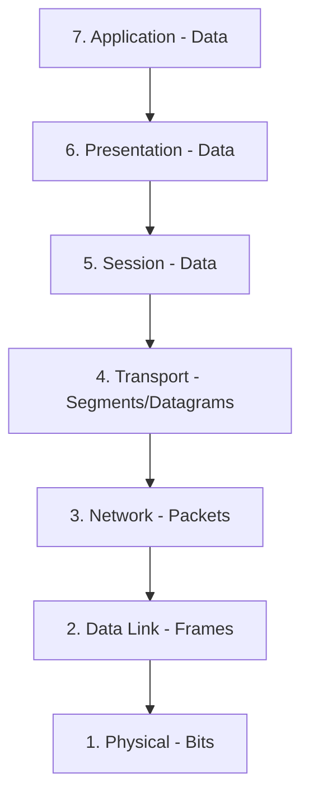
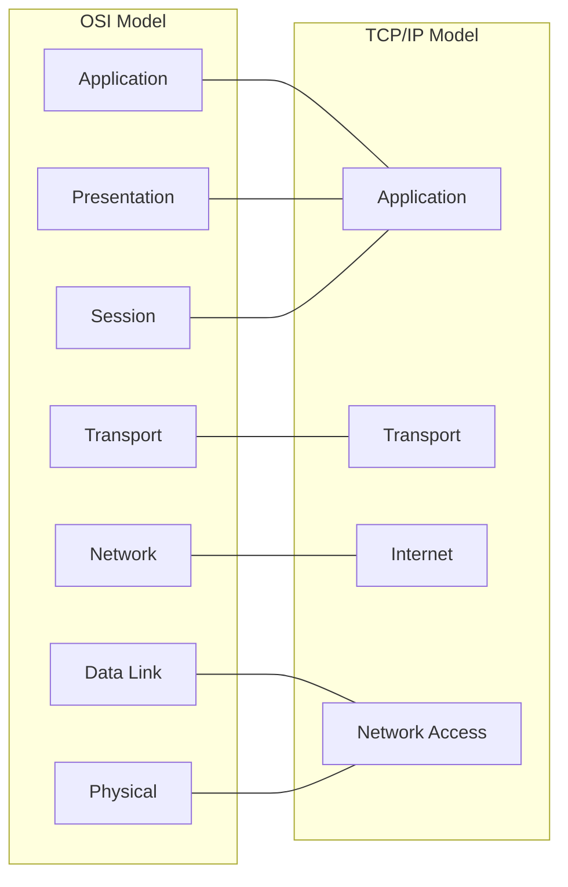
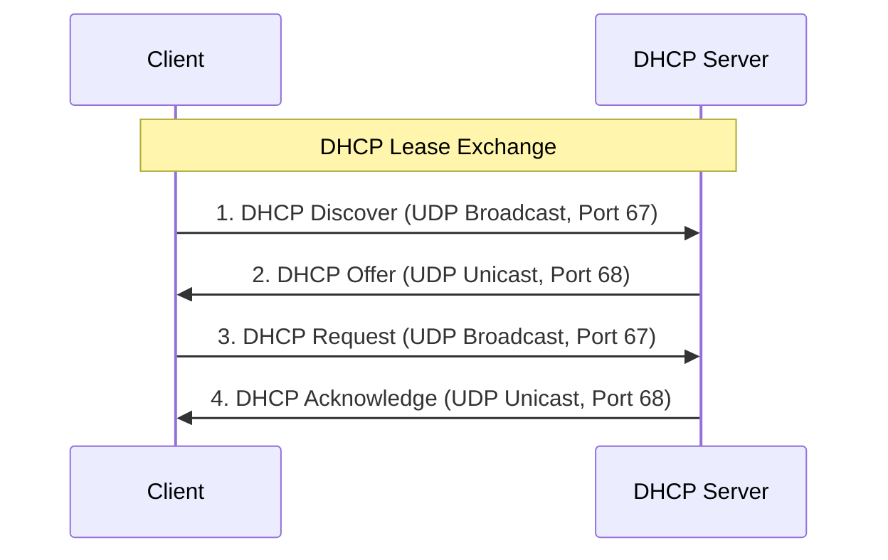
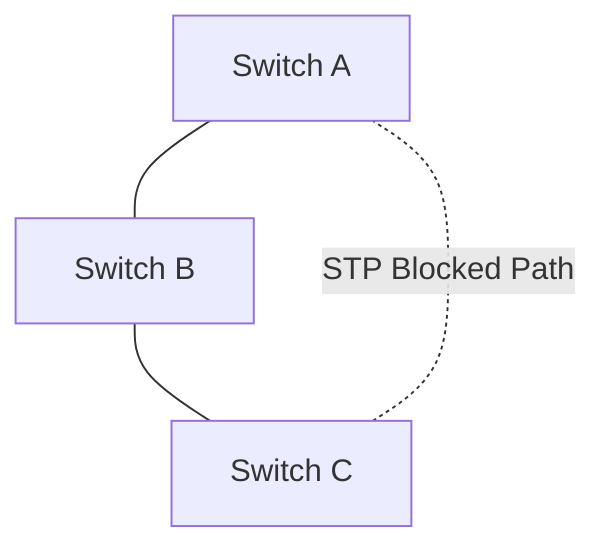

# Networking from Absolute Beginner to Advanced: The Ultimate Practical Guide

Welcome to the ultimate self-paced tutorial on computer networking. This guide starts at absolute-zero concepts and builds up to enterprise-level advanced administration, cloud/container architecture, and hands-on laboratory setups.

Use this document as both a tutorial and a long-term reference. Each chapter features essential theoretical concepts followed by concrete command-line or software-based practical labs.
  
---

## Roadmap & Table of Contents


```

[Fundamentals] ➔ [Devices & Models] ➔ [Addressing & Protocols] ➔ [Routing & Switching] ➔ [Security & Labs] ➔ [Cloud & Containers]

```

  
1. [Networking Fundamentals](#1-networking-fundamentals)

2. [Network Devices](#2-network-devices)

3. [The OSI Model (In-Depth)](#3-the-osi-model-in-depth)

4. [The TCP/IP Model](#4-the-tcpip-model)

5. [MAC Addressing](#5-mac-addressing)

6. [IP Addressing (IPv4 & IPv6)](#6-ip-addressing-ipv4--ipv6)

7. [Subnetting & CIDR Calculation](#7-subnetting--cidr-calculation)

8. [ARP (Address Resolution Protocol)](#8-arp-address-resolution-protocol)

9. [ICMP (Internet Control Message Protocol)](#9-icmp-internet-control-message-protocol)

10. [DNS (Domain Name System)](#10-dns-domain-name-system)

11. [DHCP (Dynamic Host Configuration Protocol)](#11-dhcp-dynamic-host-configuration-protocol)

12. [TCP (Transmission Control Protocol)](#12-tcp-transmission-control-protocol)

13. [UDP (User Datagram Protocol)](#13-udp-user-datagram-protocol)

14. [Common Protocols & Port Reference](#14-common-protocols--port-reference)

15. [Routing (Static & Dynamic)](#15-routing-static--dynamic)

16. [VLANs (Virtual Local Area Networks)](#16-vlans-virtual-local-area-networks)

17. [Switching Concepts (CAM, STP, Trunking)](#17-switching-concepts-cam-stp-trunking)

18. [NAT (Network Address Translation)](#18-nat-network-address-translation)

19. [Firewalls](#19-firewalls)

20. [Wireshark Packet Analysis](#20-wireshark-packet-analysis)

21. [Cisco Packet Tracer Lab Guides](#21-cisco-packet-tracer-lab-guides)

22. [Linux Networking Commands & Virtualization](#22-linux-networking-commands--virtualization)

23. [Network Security & Encryption](#23-network-security--encryption)

24. [Advanced Routing (OSPF Areas, BGP, MPLS)](#24-advanced-routing-ospf-areas-bgp-mpls)

25. [Cloud Networking (AWS, Azure, GCP)](#25-cloud-networking-aws-azure-gcp)

26. [Container Networking (Docker)](#26-container-networking-docker)

27. [Kubernetes Networking](#27-kubernetes-networking)

28. [Real-World Home Lab Setup Walkthrough](#28-real-world-home-lab-setup-walkthrough)

  

---

  

## 1. Networking Fundamentals.

### Core Concepts

*   **What is a Network?** A collection of computers, servers, mainframes, network devices, peripherals, or other devices connected to one another to allow data sharing.

*   **Geographical Types of Networks**:

    *   **PAN (Personal Area Network)**: Centered around a single person in a single location (e.g., Bluetooth connection between phone and headphones).

    *   **LAN (Local Area Network)**: Connects computers within a limited physical area, such as a home, school, or office building.

    *   **MAN (Metropolitan Area Network)**: Spans a physical area larger than a LAN but smaller than a WAN, typically covering an entire city or campus.

    *   **WAN (Wide Area Network)**: Connects computers across large physical distances (e.g., the Internet, linking multiple countries or continents).

*   **Internet vs. Intranet**:

    *   **Internet**: A global, public network of interconnected computer networks accessible by anyone.

    *   **Intranet**: A private, restricted network accessible only to an organization's staff (e.g., internal corporate websites).

*   **Architectural Designs**:

    *   **Client-Server**: Centrally managed architecture where clients request services/resources and a dedicated server provides them.

    *   **Peer-to-Peer (P2P)**: Decentralized architecture where every host (peer) acts as both a client and a server, sharing loads and files directly.

*   **Performance Metrics**:

    *   **Bandwidth**: The maximum theoretical capacity of a link to transmit data per second (e.g., Gigabit Ethernet = 1 Gbps).

    *   **Throughput**: The actual amount of data successfully transmitted over a link in real-time under practical constraints.

    *   **Latency**: The time delay for data to travel from the source to the destination.

    *   **Jitter**: The variation or fluctuation in packet arrival times (latency variance). High jitter disrupts real-time voice/video calls.

    *   **Packet Loss**: The percentage of packets sent that fail to reach their destination, usually caused by network congestion or hardware failures.

### Practical Labs

#### A. Find Your Local IP Address

Open your command-line interface (CLI) and run the appropriate command:

*   **Windows**: `ipconfig` (Look for `IPv4 Address` under your active adapter).

*   **Linux (Traditional)**: `ifconfig` or the modern version: `ip addr` / `ip a`.

*   **macOS**: `ifconfig`


#### B. Check Network Connectivity

Test connection to a remote server using ICMP echo requests:

```bash

ping google.com

```

#### C. Trace the Route to a Destination

View every router hop between your machine and a remote host:

*   **Windows**:

    ```cmd

    tracert google.com

    ```

*   **Linux / macOS**:

    ```bash

    traceroute google.com

    ```

  

---

  

## 2. Network Devices

  

### Core Concepts

  

*   **Hub**: A legacy Layer 1 device that duplicates incoming electrical signals on one port and broadcasts them to all other ports. It creates a single **collision domain**, causing frequent traffic collisions.

*   **Switch**: A Layer 2 device that reads MAC addresses in incoming frames and forwards the data only to the specific port where the destination device resides. Switches eliminate collision domains on each individual port.

*   **Router**: A Layer 3 device that routes packets across different networks using logical IP addressing and routing tables.

*   **Modem**: Modulates and demodulates signals. It translates digital signals from your local router into analog signals suited for your ISP's telephone/cable/fiber lines.

*   **Access Point (AP)**: Connects wireless client devices to a wired local area network (LAN).

*   **Firewall**: Monitors and filters incoming/outgoing network traffic based on established security rules to block unauthorized access.

*   **Gateway**: The exit point of a network. A router interface designated to forward local traffic destined for outside networks.

*   **Repeater**: Receives incoming signals, regenerates them to full strength, and retransmits them to extend physical range limits.

*   **Load Balancer**: Distributes incoming network or application traffic across a group of backend servers to prevent overload and ensure high availability.

  

### Practical Labs

  

#### A. Understanding Data Flow

A typical home/office setup forwards data in a structured path:

```

[PC] ➔ (Ethernet/WiFi) ➔ [Switch] ➔ [Router] ➔ [Modem] ➔ [ISP Gateway] ➔ [Internet]

```

#### B. Exercise: Network Topology Mapping

Draw your local home network architecture. Locate:

1. Your device's internal IP and default gateway.

2. The physical wireless router/switch unit.

3. Your router's public-facing WAN IP address (you can find this by searching "What is my IP" on a web browser).

  

---

  

## 3. The OSI Model (In-Depth)

  

The **OSI (Open Systems Interconnection) Model** is a 7-layer conceptual framework that standardizes network communication.

  



  

### Detailed Layer Specifications

  

| Layer # | Name             | Primary Purpose                                   | Protocol Data Unit (PDU)       | Core Protocols                                      | Associated Devices              |
| :------ | :--------------- | :------------------------------------------------ | :----------------------------- | :-------------------------------------------------- | :------------------------------ |
| **7**   | **Application**  | Enables human-to-network software interactions.   | Data / Message                 | HTTP, HTTPS, DNS, SSH, FTP, SMTP, DHCP              | Gateway, NGFW, PC, Servers      |
| **6**   | **Presentation** | Formats, encrypts, and compresses data.           | Data                           | SSL, TLS, ASCII, JPEG, MPEG, GIF                    | PC, Gateway                     |
| **5**   | **Session**      | Creates, manages, and tears down sessions.        | Data                           | NetBIOS, RPC, PPTP, Sockets                         | PC, Servers                     |
| **4**   | **Transport**    | Manages end-to-end transport, port assignments.   | Segment (TCP) / Datagram (UDP) | TCP, UDP                                            | Layer 4 Load Balancers          |
| **3**   | **Network**      | Resolves paths, handles IP addressing & routing.  | Packet                         | IPv4, IPv6, ICMP, IPsec, ARP                        | Routers, Layer 3 Switches       |
| **2**   | **Data Link**    | Maps MAC addresses, handles frame error checks.   | Frame                          | Ethernet (802.3), Wi-Fi (802.11), PPP               | Layer 2 Switches, NICs, Bridges |
| **1**   | **Physical**     | Transmits raw binary streams over physical media. | Bits                           | Electrical signals, Fiber pulses, radio frequencies | Cables (Cat6), Hubs, Repeaters  |

### Practical Data Walkthrough

When you type `https://google.com` into your browser, your data is encapsulated down the stack:


```

[Layer 7: Application]  ➔ Adds HTTP GET Request

[Layer 6: Presentation] ➔ Encrypts request with TLS/SSL

[Layer 5: Session]      ➔ Establishes socket connection

[Layer 4: Transport]    ➔ Appends source/dest ports (e.g., Src: 51234, Dest: 443 TCP)

[Layer 3: Network]      ➔ Appends IP header (Src IP: 192.168.1.50, Dest IP: 142.250.x.x)

[Layer 2: Data Link]    ➔ Appends Ethernet header (Src MAC: AA:BB:CC, Dest MAC/Gateway: DD:EE:FF)

[Layer 1: Physical]     ➔ Translates frames to electrical/optical signals over the cable

```


---

## 4. The TCP/IP Model

  

The **TCP/IP Model** (Internet Protocol Suite) is a streamlined 4-layer framework that forms the practical basis of modern internet networking.

  



### Layer Comparison & Key Differences

*   **Application Layer**: Maps to OSI Layers 5, 6, and 7. Combines user interface, translation, and session management.

*   **Transport Layer**: Maps directly to OSI Layer 4. Manages flow control and port connections.

*   **Internet Layer**: Maps directly to OSI Layer 3. Manages logical routing and IP address assignment.

*   **Network Access Layer**: Maps to OSI Layers 1 and 2. Manages physical cabling and hardware address framing.

  

---

## 5. MAC Addressing

### Core Concepts

*   **MAC Address (Media Access Control)**: A globally unique 48-bit physical address burned into a Network Interface Card (NIC) during manufacturing. It is written as 12 hexadecimal characters separated by colons or hyphens (e.g., `00:1A:2B:3C:4D:5E`).

    *   **OUI (Organizationally Unique Identifier)**: The first 24 bits (first 6 characters) represent the manufacturer.

    *   **NIC Identifier**: The last 24 bits represent a unique serial number assigned to that interface.

*   **Transmission Methods**:

    *   **Unicast**: Data is sent from a single source to a single destination address.

    *   **Broadcast**: Data is sent from a single source to all devices on the local subnet. The destination MAC address is set to `FF:FF:FF:FF:FF:FF`.

    *   **Multicast**: Data is sent from one source to a defined group of interested destination devices (e.g., streaming setups).

  

### Practical Labs

  

#### Locate Your Hardware MAC Address

*   **Windows**:

    ```cmd

    ipconfig /all

    ```

    *Look for the "Physical Address" line under your active network adapter.*

*   **Linux / macOS**:

    ```bash

    ip link show

    # or

    ifconfig

    ```

    *Look for the text `ether` (e.g., `ether 00:0c:29:ab:cd:ef`).*

  

---

  

## 6. IP Addressing (IPv4 & IPv6)


### Core Concepts


An IP address provides a logical identifier for routers to transport data across different networks.

*   **IPv4 Addresses**: 32-bit addresses formatted as four 8-bit octets separated by decimals (e.g., `192.168.1.100`).

*   **IPv6 Addresses**: 128-bit addresses written in hexadecimal notation and grouped by colons (e.g., `2001:0db8:85a3:0000:0000:8a2e:0370:7334`). Consecutive groups of zeros can be abbreviated as `::` (e.g., `2001:db8::8a2e:370:7334`).

#### IPv4 Classful Schemes

| Class       | First Octet Range               | Default Subnet Mask   | Purpose / Notes                                                       |
| :---------- | :------------------------------ | :-------------------- | :-------------------------------------------------------------------- |
| **Class A** | `1.0.0.0` - `126.255.255.255`   | `255.0.0.0` (/8)      | Large scale networks. (Address `127.x.x.x` is reserved for Loopback). |
| **Class B** | `128.0.0.0` - `191.255.255.255` | `255.255.0.0` (/16)   | Mid-size networks.                                                    |
| **Class C** | `192.0.0.0` - `223.255.255.255` | `255.255.255.0` (/24) | Small local networks.                                                 |
| **Class D** | `224.0.0.0` - `239.255.255.255` | N/A                   | Reserved for Multicast.                                               |
| **Class E** | `240.0.0.0` - `255.255.255.255` | N/A                   | Reserved for research and testing.                                    |

#### RFC 1918 Private Ranges (Non-Routable on Public Internet)

*   **10.0.0.0/8**: Range `10.0.0.0` – `10.255.255.255`

*   **172.16.0.0/12**: Range `172.16.0.0` – `172.31.255.255`

*   **192.168.0.0/16**: Range `192.168.0.0` – `192.168.255.255`

  

### Practical Lab: Manually Connect Two Local Hosts

Connect two PCs (or virtual machines) together using an Ethernet cable or a shared host-only virtual switch network.

  

1.  **Configure PC 1**:

    *   Set Static IP: `192.168.1.10`

    *   Set Subnet Mask: `255.255.255.0`

2.  **Configure PC 2**:

    *   Set Static IP: `192.168.1.20`

    *   Set Subnet Mask: `255.255.255.0`

3.  **Test Connectivity**:

    From PC 1, ping PC 2:

    ```bash

    ping 192.168.1.20

    ```

  

---

  

## 7. Subnetting & CIDR Calculation

  

### Core Concepts

  

Subnetting divides a larger network address range into smaller, isolated networks to improve performance, manage routing, and enhance security.

  

*   **CIDR (Classless Inter-Domain Routing)**: A method for allocating IP addresses and routing IP packets where you define the number of bits allocated to the network prefix (e.g., `/24`).

*   **Network Address**: The first address in a subnet range. It identifies the network itself and cannot be assigned to hosts.

*   **Broadcast Address**: The last address in a subnet range. It broadcasts packets to all host devices on that subnet.

*   **Host Addresses**: The range of usable IP addresses between the network address and the broadcast address.

  

### The Subnetting Math

For any given subnet mask of size `/N`:

1.  Calculate total host bits: $H = 32 - N$.

2.  Calculate total IP addresses: $2^H$.

3.  Calculate total usable host addresses: $2^H - 2$ (excluding the network and broadcast addresses).

  

### Common Subnets Reference Table

  

| CIDR Prefix | Subnet Mask       | Total IPs | Usable IPs |
| :---------- | :---------------- | :-------- | :--------- |
| **`/24`**   | `255.255.255.0`   | 256       | 254        |
| **`/25`**   | `255.255.255.128` | 128       | 126        |
| **`/26`**   | `255.255.255.192` | 64        | 62         |
| **`/27`**   | `255.255.255.224` | 32        | 30         |
| **`/28`**   | `255.255.255.240` | 16        | 14         |
| **`/30`**   | `255.255.255.252` | 4         | 2          |

### Practical Exercises (Test Your Subnetting Knowledge)

Find the Network Address, Broadcast Address, and Usable IP range for the following hosts:

1.  **`192.168.1.50/26`**:

    *   *Hint*: `/26` divides networks into blocks of 64. `50` falls in the first block: `0` to `63`.

    *   *Network IP*: `192.168.1.0`

    *   *First Usable*: `192.168.1.1`

    *   *Last Usable*: `192.168.1.62`

    *   *Broadcast IP*: `192.168.1.63`

2.  **`10.0.0.18/28`**:

    *   *Hint*: `/28` divides networks into blocks of 16. `18` falls in the second block: `16` to `31`.

    *   *Network IP*: `10.0.0.16`

    *   *Broadcast IP*: `10.0.0.31`

  

---

  

## 8. ARP (Address Resolution Protocol)

### Core Concepts

  

```

[Layer 3 IP Address] ➔ ➔ (ARP Request/Reply) ➔ ➔ [Layer 2 MAC Address]

```

  

*   **How ARP Works**: Devices on a local network can only communicate with each other using MAC addresses. If Device A knows Device B's IP address but not its MAC address, it broadcasts an **ARP Request** (`"Who has IP 192.168.1.20? Tell 192.168.1.10"`). Device B returns a unicast **ARP Reply** containing its MAC address.

*   **ARP Cache Table**: A temporary local lookup table where devices store resolved IP-to-MAC mappings to avoid sending ARP requests for every packet.

  

### Practical Labs

  

#### Inspect Your Local ARP Cache Table

*   **Windows / Linux / macOS**:

    ```bash

    arp -a

    ```

    *(Observe the IP addresses listed alongside their physical hardware addresses).*

  

---

  

## 9. ICMP (Internet Control Message Protocol)

  

### Core Concepts

  

*   **Purpose**: ICMP handles network diagnostics and error reporting. It operates at Layer 3 of the OSI model.

*   **Core Message Types**:

    *   **Echo Request (Type 8)**: Sent by a client to verify host connectivity (created by a ping command).

    *   **Echo Reply (Type 0)**: Sent by a remote host in response to an Echo Request.

    *   **Destination Unreachable (Type 3)**: Sent by a router or firewall when a route to the destination IP cannot be resolved.

    *   **Time Exceeded (Type 11)**: Sent by a router when a packet's Time-To-Live (TTL) field reaches `0` during transit, which is how the traceroute utility discovers routing hops.

  

### Practical Labs

  

#### A. Ping a Host and Observe Details

```bash

ping -c 4 google.com

```

*Observe the round-trip times (RTT) and the TTL values in the output.*

  

#### B. Observe ICMP Hops via Tracert

```bash

tracert 8.8.8.8

```

*Note how each hop replies with ICMP Time Exceeded packets, confirming the router's identity.*

  

---

  

## 10. DNS (Domain Name System)

  

### Core Concepts

  

DNS maps user-friendly domain names to numerical IP addresses.

  

```

User types "example.com" ➔ Local Resolver ➔ Root Server (.) ➔ TLD Server (.com) ➔ Authoritative Nameserver ➔ IP Address returned to client

```

  

#### Core DNS Record Types

*   **A Record**: Resolves a hostname to a 32-bit IPv4 address.

*   **AAAA Record**: Resolves a hostname to a 128-bit IPv6 address.

*   **CNAME (Canonical Name)**: Maps an alias hostname to a primary domain name (e.g., `www.example.com` to `example.com`).

*   **MX (Mail Exchanger)**: Specifies the mail servers responsible for receiving email for a domain.

*   **TXT (Text)**: Holds descriptive text data, commonly used for SPF, DKIM, and DMARC email authentication security checks.

  

### Practical Labs

  

#### A. Resolve Domain Records on Windows

```cmd

nslookup google.com

```

  

#### B. Query Records on Linux/macOS

```bash

dig google.com

```

To view only MX records:

```bash

dig google.com MX

```

  

---

  

## 11. DHCP (Dynamic Host Configuration Protocol)

  

### Core Concepts

  

DHCP dynamically assigns network parameters to host interfaces, streamlining local network administration.

  

#### The DORA Process

  



  

1.  **Discover**: The client broadcasts a message to locate available DHCP servers on the subnet.

2.  **Offer**: Servers respond with proposed IP configuration settings.

3.  **Request**: The client requests the configuration from the chosen DHCP server.

4.  **Acknowledge**: The server confirms the request and assigns the IP lease to the client.

  

### Practical Labs

  

#### A. Inspect Your Lease

*   **Windows**:

    ```cmd

    ipconfig /all

    ```

    *Find the "Lease Obtained" and "Lease Expires" times under your active interface.*

  

#### B. Renew Your DHCP Lease

*   **Windows**:

    ```cmd

    ipconfig /release

    ipconfig /renew

    ```

  

---

  

## 12. TCP (Transmission Control Protocol)

  

### Core Concepts

  

TCP is a reliable, connection-oriented transport protocol operating at Layer 4 of the OSI model.

  

*   **The 3-Way Handshake**:

    1.  **SYN**: Client sends a Synchronize packet with a random initial sequence number ($X$).

    2.  **SYN-ACK**: Server acknowledges the request ($ACK = X + 1$) and sends its own synchronize sequence number ($Y$).

    3.  **ACK**: Client acknowledges the response ($ACK = Y + 1$), establishing the connection.

*   **Reliability Mechanisms**:

    *   **Acknowledgements (ACKs)**: Receivers must acknowledge every packet received. Unacknowledged packets are retransmitted.

    *   **Sequencing**: Packets are numbered so the receiver can reassemble them in the correct order.

*   **Flow Control**: Uses a sliding window mechanism to adjust transmission speeds based on the receiver's buffer capacity.

*   **Congestion Control**: Slows transmission rates when packet drops or latency spikes are detected along the network path.

  

---

  

## 13. UDP (User Datagram Protocol)

### Core Concepts  

UDP is a lightweight, connectionless transport protocol operating at Layer 4 of the OSI model.

  

*   **Key Characteristics**:

    *   No handshake process or connection state tracking.

    *   Sends packets on a best-effort basis without delivery confirmations or retransmissions.

    *   Adds minimal processing overhead, reducing latency.

*   **Common Use Cases**: DNS queries, DHCP exchanges, NTP synchronization, live video streaming, voice calls (VoIP), and online gaming.

### TCP vs. UDP Comparison

| Feature              | TCP                                           | UDP                                        |
| :------------------- | :-------------------------------------------- | :----------------------------------------- |
| **Connection State** | Connection-oriented (Handshake required)      | Connectionless (No handshake)              |
| **Reliability**      | Guaranteed delivery (Retransmits lost data)   | Best-effort delivery (Packets can be lost) |
| **Ordering**         | Guarantees sequential packet delivery         | No ordering guarantees                     |
| **Speed**            | Slower (due to transmission headers and ACKs) | Faster (minimal overhead)                  |
| **Header Size**      | 20 - 60 Bytes                                 | 8 Bytes                                    |

  

---

  

## 14. Common Protocols & Port Reference

  

The Transport layer uses ports to direct incoming traffic to the correct application service. Memorize these standard port assignments:

  

| Protocol Name                     | Abbreviation | Layer      | Default Port | Primary Function                              |
| :-------------------------------- | :----------- | :--------- | :----------- | :-------------------------------------------- |
| **File Transfer Protocol**        | FTP          | L4 TCP     | `20 / 21`    | Transfers files between client and server.    |
| **Secure Shell**                  | SSH          | L4 TCP     | `22`         | Secures remote login access.                  |
| **Telnet**                        | Telnet       | L4 TCP     | `23`         | Unencrypted legacy remote terminal interface. |
| **Simple Mail Transfer Protocol** | SMTP         | L4 TCP     | `25`         | Sends mail messages across servers.           |
| **Domain Name System**            | DNS          | L4 TCP/UDP | `53`         | Resolves domain name lookups.                 |
| **Dynamic Host Configuration**    | DHCP         | L4 UDP     | `67 / 68`    | Dynamically leases host IPs.                  |
| **Hypertext Transfer Protocol**   | HTTP         | L4 TCP     | `80`         | Serves unencrypted web pages.                 |
| **Hypertext Transfer Secure**     | HTTPS        | L4 TCP     | `443`        | Serves encrypted, secure web traffic.         |

  

---

  

## 15. Routing (Static & Dynamic)

  

### Core Concepts

  

Routing is the process of selecting paths across networks to direct traffic toward its destination.

  

*   **Static Routing**: Routes are manually configured by an administrator. Best suited for small networks or fixed connections.

*   **Dynamic Routing**: Routers automatically exchange routing tables and update paths using specialized routing protocols.

*   **Dynamic Protocols**:

    *   **RIP (Routing Information Protocol)**: Distance-vector protocol that uses hop count as its metric (maximum of 15 hops).

    *   **OSPF (Open Shortest Path First)**: Link-state protocol that uses path cost (based on bandwidth) to build a topological map of the network.

    *   **EIGRP (Enhanced Interior Gateway Routing Protocol)**: Cisco proprietary hybrid protocol using bandwidth, delay, reliability, and load metrics.

    *   **BGP (Border Gateway Protocol)**: Path-vector protocol that manages routing across the global internet (Autonomous Systems).

  

```

   [Subnet 1] ➔ [Router A] ➔ (Dynamic OSPF routing) ➔ [Router B] ➔ [Subnet 2]

```

  

### Practical Lab: Cisco Packet Tracer Routing Setup

1.  Place two routers (`2911`) and two PCs in the workspace.

2.  Connect PC1 to Router 1, connect Router 1 to Router 2, and connect Router 2 to PC2.

3.  Configure IP addresses for the devices:

    *   PC 1: `192.168.1.10/24` (Gateway: `192.168.1.1`)

    *   Router 1 GigabitEthernet0/0: `192.168.1.1/24`

    *   Router 1 GigabitEthernet0/1 (Serial/Link Interface): `10.0.0.1/30`

    *   Router 2 GigabitEthernet0/1 (Serial/Link Interface): `10.0.0.2/30`

    *   Router 2 GigabitEthernet0/0: `192.168.2.1/24`

    *   PC 2: `192.168.2.10/24` (Gateway: `192.168.2.1`)

4.  Configure static routing on **Router 1**:

    ```text

    Router(config)# ip route 192.168.2.0 255.255.255.0 10.0.0.2

    ```

5.  Configure static routing on **Router 2**:

    ```text

    Router(config)# ip route 192.168.1.0 255.255.255.0 10.0.0.1

    ```

6.  Ping PC2 from PC1 to verify end-to-end connectivity.

  

---

  

## 16. VLANs (Virtual Local Area Networks)

  

### Core Concepts

  

*   **VLAN (Virtual LAN)**: Groups network devices logically regardless of their physical location. VLANs partition a single physical switch into multiple virtual switches to isolate broadcast domains.

*   **Trunking (802.1Q)**: Carries traffic for multiple VLANs over a single physical link between switches, appending a tag to each frame to identify its associated VLAN.

  

```

Switch Port 1 (VLAN 10) -- [Finance Dept] \

                                            ===> Trunk Link (802.1Q Tags)

Switch Port 2 (VLAN 20) -- [HR Dept]      /

```

  

### Practical Lab: Cisco Packet Tracer VLAN Configuration

1.  Place a switch (`2960`) and connect four PCs: PC1, PC2 (designated for VLAN 10), and PC3, PC4 (designated for VLAN 20).

2.  Open the switch CLI and create the VLANs:

    ```text

    Switch# configure terminal

    Switch(config)# vlan 10

    Switch(config-vlan)# name Finance

    Switch(config-vlan)# exit

    Switch(config)# vlan 20

    Switch(config-vlan)# name HR

    ```

3.  Assign switch ports to the VLANs:

    ```text

    Switch(config)# interface range fa0/1 - 2

    Switch(config-if-range)# switchport mode access

    Switch(config-if-range)# switchport access vlan 10

    Switch(config-if-range)# exit

    Switch(config)# interface range fa0/3 - 4

    Switch(config-if-range)# switchport mode access

    Switch(config-if-range)# switchport access vlan 20

    ```

4.  Verify that PC1 can ping PC2, but PC1 cannot ping PC3 (since the VLANs are isolated).

  

---

  

## 17. Switching Concepts (CAM, STP, Trunking)

  

### Core Concepts

  

*   **CAM (Content Addressable Memory) / MAC Table**: A table stored in switch memory that maps MAC addresses to their corresponding physical ports.

*   **STP (Spanning Tree Protocol - 802.1D)**: A loop-prevention protocol. It blocks redundant physical paths in a switched network to prevent broadcast storms, dynamically enabling them if an active link fails.

*   **Trunking Ports vs Access Ports**:

    *   **Access Ports**: Connect end-devices (PCs, printers) and carry traffic for only one assigned VLAN.

    *   **Trunk Ports**: Connect switches together and carry traffic for all available VLANs.

  



  

### Practical Labs

  

#### View a Switch's MAC Address Table (Cisco CLI)

```text

Switch# show mac address-table

```

*Observe the learned MAC addresses mapped to their respective switch interfaces.*

  

---

  

## 18. NAT (Network Address Translation)

  

### Core Concepts

  

NAT translates private IP addresses to public IPs, allowing multiple local devices to access the internet using a single public address.

  

*   **Static NAT**: Maps a single private IP address to a single public IP address (typically used for internal servers).

*   **Dynamic NAT**: Maps private IP addresses to public IPs from a pool of available public addresses.

*   **PAT (Port Address Translation / NAT Masquerading)**: Maps multiple private IP addresses to a single public IP address by assigning unique port numbers to each traffic session.

  

```

Inside Private LAN                  Router with PAT                    Public Internet

192.168.1.10:12435  ======>  Translates to public IP  ======>  203.0.113.1:50001

192.168.1.20:12435  ======>  Translates to public IP  ======>  203.0.113.1:50002

```

  

---

  

## 19. Firewalls

  

### Core Concepts

  

*   **Packet Filtering (Stateless)**: Inspects individual packets in isolation, filtering traffic based on source/destination IP, protocol, and port numbers without tracking connection states.

*   **Stateful Inspection Firewalls**: Monitors the state of active network connections, allowing return traffic for established sessions while blocking unsolicited incoming packets.

*   **NGFW (Next-Generation Firewall)**: Combines traditional firewall capabilities with deep packet inspection (DPI), intrusion prevention (IPS), application-level control, and SSL decryption.

  

### Practical Lab: Block Pings (ICMP) via Windows Defender Firewall

To block incoming pings to your machine:

  

1.  Open the **Windows Defender Firewall with Advanced Security** console.

2.  Click **Inbound Rules** in the left pane, then select **New Rule...** in the right pane.

3.  Set the Rule Type to **Custom**.

4.  In the Protocol and Ports step, set the Protocol type to **ICMPv4**.

5.  Set the Action step to **Block the connection**.

6.  Name the rule `Block Pings Lab` and save it.

7.  Attempt to ping your machine from another local device. The pings should now time out. Turn the rule off once the lab is complete.

  

---

  

## 20. Wireshark Packet Analysis

  

### Core Concepts

  

Wireshark captures and displays packet data from a network interface in real time, allowing you to inspect headers and payloads at every layer of the OSI model.

  

```

[Packet Capture Engine] ➔ Apply Filters (e.g. "dns" or "tcp.port == 80") ➔ Analyze Payload Hex Data

```

  

### Core Capture Filters

To isolate specific traffic in the capture window:

  

*   **`ip.addr == 192.168.1.10`**: Displays only packets sent to or from this IP address.

*   **`tcp.port == 80`**: Displays only HTTP traffic.

*   **`dns`**: Displays only DNS query and response packets.

*   **`http`**: Displays HTTP requests (`GET`, `POST`) and server responses.

*   **`arp`**: Displays ARP requests and replies.

*   **`icmp`**: Displays ping requests and replies.

  

### Practical Exercises

1.  Start a packet capture on your active interface in Wireshark.

2.  Open your command line and ping a public domain (e.g., `ping 8.8.8.8`).

3.  Stop the capture and apply the `icmp` filter.

4.  Examine the packet details pane. Locate:

    *   **Ethernet II Header**: Source and destination MAC addresses.

    *   **Internet Protocol Version 4 Header**: Source and destination IP addresses.

    *   **ICMP Header**: Type (`8` for request, `0` for reply).

  

---

  

## 21. Cisco Packet Tracer Lab Guides

  

Use these configuration exercises to build practical network administration skills in Cisco Packet Tracer.

  

---

  

### Lab 1: Connecting Two PCs

*   **Objective**: Configure two devices to communicate directly.

*   **Topology**: PC1 connected to PC2 using a Copper Cross-Over cable (or straight-through on modern autosensing interfaces).

*   **Configuration**:

    *   PC 1 IP: `192.168.1.10/24`

    *   PC 2 IP: `192.168.1.20/24`

*   **Verification**: Open PC1's command prompt and run `ping 192.168.1.20`.

  

---

  

### Lab 2: Static IP Setup with Switch

*   **Objective**: Connect multiple client devices to a shared local network.

*   **Topology**: Connect three PCs to a single `2960` switch using Copper Straight-Through cables.

*   **Configuration**: Assign static IP addresses: `192.168.1.11/24`, `192.168.1.12/24`, and `192.168.1.13/24`.

*   **Verification**: Confirm that each device can ping the other hosts on the switch.

  

---

  

### Lab 3: DHCP Server Lab

*   **Objective**: Automate local IP assignment using a dedicated server node.

*   **Topology**: Connect a Server (labeled `DHCP-Server`) and two client PCs to a `2960` switch.

*   **Server Setup**:

    1.  Assign a static IP to the Server: `192.168.1.254/24`.

    2.  Navigate to the **Services** tab and select **DHCP**.

    3.  Enable the service, set the Default Gateway to `192.168.1.1`, set the Start IP Address to `192.168.1.100`, and click **Save**.

*   **Client Setup**: Open the IP configuration settings for PC1 and PC2, then change the selection from Static to **DHCP**.

*   **Verification**: Ensure the client PCs receive IP addresses in the `192.168.1.100+` range.

  

---

  

### Lab 4: Local DNS Server Setup

*   **Objective**: Resolve local hostnames within a private domain.

*   **Topology**: Add a second server to the switch in Lab 3, labeling it `DNS-Server`.

*   **Configuration**:

    1.  Assign a static IP to the DNS Server: `192.168.1.253/24`.

    2.  Navigate to **Services** -> **DNS**.

    3.  Enable DNS, add a new **A Record**: Name = `myshop.local`, Address = `192.168.1.254` (the DHCP/Web server IP). Click **Add**.

    4.  Update the DHCP Server pool settings so the DNS Server field points to `192.168.1.253`.

*   **Verification**: Open the web browser on PC1, type `myshop.local`, and verify that the server's default webpage loads.

  

---

  

### Lab 5: Basic Router Configuration

*   **Objective**: Configure router interfaces and enable logical gateways.

*   **Topology**: Connect a PC to interface `Gig0/0` on a `1911` Router using a straight-through cable.

*   **Configuration**:

    ```text

    Router> enable

    Router# configure terminal

    Router(config)# interface gigabitethernet 0/0

    Router(config-if)# ip address 192.168.1.1 255.255.255.0

    Router(config-if)# no shutdown

    ```

*   **Verification**: Assign IP `192.168.1.10/24` to the PC, set the gateway to `192.168.1.1`, and verify that you can ping the gateway.

  

---

  

### Lab 6: VLAN Segmentation Lab

*   **Objective**: Restrict communication between local departments.

*   **Topology**: Build a network with four PCs connected to a switch, grouped into VLAN 10 (`Finance`) and VLAN 20 (`HR`).

*   **Configuration**:

    ```text

    Switch(config)# vlan 10

    Switch(config-vlan)# name Finance

    Switch(config)# interface range fa0/1 - 10

    Switch(config-if-range)# switchport access vlan 10

    ```

    *(Repeat configuration steps for VLAN 20 on interfaces `fa0/11-20`)*.

*   **Verification**: Verify that pinging between VLAN 10 and VLAN 20 is blocked.

  

---

  

### Lab 7: OSPF Dynamic Routing

*   **Objective**: Set up dynamic route discovery between multiple networks.

*   **Topology**: Connect Router A (`Gig0/0`: `192.168.1.1/24`, `Serial0/0/0`: `10.10.10.1/30`) to Router B (`Gig0/0`: `192.168.2.1/24`, `Serial0/0/0`: `10.10.10.2/30`).

*   **Router A Configuration**:

    ```text

    RouterA(config)# router ospf 1

    RouterA(config-router)# network 192.168.1.0 0.0.0.255 area 0

    RouterA(config-router)# network 10.10.10.0 0.0.0.3 area 0

    ```

*   **Router B Configuration**:

    ```text

    RouterB(config)# router ospf 1

    RouterB(config-router)# network 192.168.2.0 0.0.0.255 area 0

    RouterB(config-router)# network 10.10.10.0 0.0.0.3 area 0

    ```

*   **Verification**: Verify that PC1 (`192.168.1.10`) can ping PC2 (`192.168.2.10`).

  

---

  

### Lab 8: Static NAT Setup

*   **Objective**: Map an internal web server to a public IP address.

*   **Topology**: Connect a router to an internal LAN Switch and an external network router.

*   **Configuration**:

    ```text

    Router(config)# interface fa0/0

    Router(config-if)# ip nat inside

    Router(config)# interface gig0/0

    Router(config-if)# ip nat outside

    Router(config)# ip nat inside source static 192.168.1.100 203.0.113.10

    ```

*   **Verification**: Verify that external devices can reach the web server using the public IP address `203.0.113.10`.

  

---

  

### Lab 9: Standard Access Control Lists (ACL)

*   **Objective**: Restrict traffic to a sensitive network using ACL rules.

*   **Topology**: Connect multiple subnets to a central router.

*   **Configuration**:

    ```text

    # Block traffic from 192.168.1.10, but allow all other hosts

    Router(config)# access-list 1 deny host 192.168.1.10

    Router(config)# access-list 1 permit any

    Router(config)# interface gig0/0

    Router(config-if)# ip access-group 1 out

    ```

*   **Verification**: Confirm that the blocked host receives a "Destination Host Unreachable" response when trying to communicate, while other hosts can connect normally.

  

---

  

### Lab 10: Enterprise Topology Integration

*   **Objective**: Combine switching, routing, VLANs, and NAT into a single network topology.

*   **Topology**: Build the following integrated network topology:

  

```

[VLAN 10 Client] \

                   ===> [Core Switch] ➔ [Router] ➔ (NAT/PAT) ➔ [ISP Gateway] ➔ [Web Server]

[VLAN 20 Client] /

```

  

---

  

## 22. Linux Networking Commands & Virtualization

  

Linux is the foundational OS for modern network infrastructure, hosting, and cloud routing.

  

### Essential Networking Commands

  

*   **`ip address`** / **`ip a`**: Displays IP interfaces, states, and addresses.

*   **`ip route`**: Displays the active kernel routing table.

*   **`netstat -tulnp`**: Displays active TCP/UDP connections and the processes listening on open ports.

*   **`ss -tulpn`**: Modern, faster replacement for `netstat`.

*   **`tcpdump -i eth0`**: A CLI packet capture utility. To capture TCP port 80 traffic on interface `eth0`:

    ```bash

    sudo tcpdump -i eth0 tcp port 80

    ```

*   **`nmap -sS -p- 192.168.1.1`**: A security scanner used to discover hosts and open ports on a network.

  

### Linux Network Virtualization Concepts

*   **Veth Pairs (Virtual Ethernet)**: Act as virtual patch cables to connect network namespaces.

*   **Linux Bridge**: Acts as a virtual Layer 2 switch inside the Linux kernel to link physical interfaces and virtual interfaces (like VMs or containers).

  

---

  

## 23. Network Security & Encryption

  

Securing data in transit is critical to protect against interception, tampering, and unauthorized access.

  

### Core Security Architecture

*   **VPN (Virtual Private Network)**: Creates an encrypted tunnel over public networks to connect remote users or sites securely.

*   **IPsec (Internet Protocol Security)**: A protocol suite that authenticates and encrypts packets at Layer 3, commonly used for site-to-site VPN tunnels.

*   **SSL/TLS (Secure Sockets Layer / Transport Layer Security)**: Cryptographic protocols that secure communications over TCP at the session/presentation layers (e.g., HTTPS).

*   **IDS vs. IPS**:

    *   **IDS (Intrusion Detection System)**: Passively monitors network traffic for signatures of known attacks and alerts administrators.

    *   **IPS (Intrusion Prevention System)**: Actively monitors traffic and automatically blocks suspicious activity to prevent attacks.

*   **Zero Trust Architecture**: A security model based on the principle of "never trust, always verify," requiring continuous authentication and authorization for every access request.

  

---

  

## 24. Advanced Routing (OSPF Areas, BGP, MPLS)

  

### Core Concepts

  

*   **OSPF Areas**: Divides a large OSPF network into logical groups (areas) to limit routing table sizes and restrict route calculation updates. Area 0 acts as the mandatory backbone area that connects all other areas.

*   **BGP (Border Gateway Protocol)**: The routing protocol of the global internet. It manages path vector routing across Autonomous Systems (AS).

    *   **iBGP (Internal BGP)**: Used to route traffic between BGP routers within the same Autonomous System.

    *   **eBGP (External BGP)**: Used to route traffic between routers in different Autonomous Systems.

*   **Route Redistribution**: Translates and transfers routing information between different routing protocols (e.g., sharing routes between OSPF and BGP).

*   **MPLS (Multiprotocol Label Switching)**: Pre-determines data paths using short path labels rather than routing tables, speeding up packet forwarding in service provider networks.

  

---

  

## 25. Cloud Networking (AWS, Azure, GCP)

  

Public cloud providers use virtualized software-defined networking (SDN) to build isolated infrastructure.

  

### Core Cloud Components

  

*   **VPC (Virtual Private Cloud) / VNet**: A private, isolated logical network section within a public cloud provider's infrastructure.

*   **Subnets**: Partitions a VPC's IP address range into smaller segments.

    *   **Public Subnet**: Connected to an internet gateway, allowing resources to communicate directly with the internet.

    *   **Private Subnet**: Isolated from direct internet access, typically hosting backend resources (like databases).

*   **Route Tables**: Rules that determine where network traffic from subnets is directed.

*   **Security Groups**: Virtual firewalls that control inbound and outbound traffic at the resource level (instance/VM). They are stateful.

*   **Network Access Control Lists (NACLs)**: Stateless firewalls that control inbound and outbound traffic at the subnet level.

*   **Load Balancers (ALB/NLB)**: Automatically distribute incoming traffic across multiple target instances to ensure reliability.

  

---

  

## 26. Container Networking (Docker)

  

Docker uses container network namespaces to isolate container communications.

  

### Core Network Drivers

*   **Bridge (Default)**: Creates a private virtual network bridge on the host. Containers connected to this network can communicate with each other using IP addresses or hostnames, but are isolated from external networks.

*   **Host**: Removes network isolation between the container and the host machine, allowing the container to share the host's network interfaces and IP address directly.

*   **Overlay**: Connects containers across multiple physical Docker hosts, enabling secure communication in Docker Swarm deployments.

*   **None**: Disables all networking for the container.

  

### Practical Labs

  

#### A. List Active Docker Networks

```bash

docker network ls

```

  

#### B. Create a Custom Bridge Network

```bash

docker network create --driver bridge my_isolated_net

```

  

#### C. Run a Container on Your Custom Network

```bash

docker run -d --name test_web --network my_isolated_net nginx

```

  

---

  

## 27. Kubernetes Networking

  

Kubernetes has a fundamental networking model: every Pod receives a unique, routable IP address within the cluster, eliminating the need to map host ports to container ports.

  

### Core Networking Components

*   **Pod-to-Pod Communication**: Every Pod can communicate with all other Pods in the cluster using their IP addresses, without using NAT.

*   **CNI (Container Network Interface)**: A plugin framework that configures network connectivity for Pods (e.g., Calico, Flannel, Cilium).

*   **Services**: Abstractions that define a logical set of Pods and policy rules to access them.

    *   **ClusterIP**: Exposes the Service on a cluster-internal IP (only accessible within the cluster).

    *   **NodePort**: Exposes the Service on each Node's IP at a static port.

    *   **LoadBalancer**: Exposes the Service externally using a cloud provider's external load balancer.

*   **Ingress**: An API object that manages external access to services in a cluster, typically providing HTTP/HTTPS routing, load balancing, and SSL termination.

  

---

  

## 28. Real-World Home Lab Setup Walkthrough

  

To practice advanced networking concepts, you can build a complete network topology using virtual machines on a single host computer.

  

```

                  +----------------------------------+

                  |            Host Machine          |

                  |          (e.g., Windows)         |

                  +----------------------------------+

                                   |

                     [Host-Only Virtual Network]

                                   |

                 +-----------------------------------+

                 |           Router VM               |

                 |      (pfsense, OPNsense, Linux)   |

                 +-----------------------------------+

                   /                               \

                  /                                 \

  [Internal Network 1: Finance]      [Internal Network 2: HR]

                |                                   |

      +--------------------+              +--------------------+

      |     Ubuntu VM      |              |     Windows VM     |

      |   (192.168.10.2)   |              |   (192.168.20.2)   |

      +--------------------+              +--------------------+

```

  

### Setup Instructions

  

#### 1. Hypervisor Installation

Download and install a hypervisor, such as **Oracle VM VirtualBox** or **VMware Workstation Pro**.

  

#### 2. Virtual Networking Configuration

In your hypervisor settings, create two distinct host-only networks:

*   `VLAN_Finance` (Subnet: `192.168.10.0/24`)

*   `VLAN_HR` (Subnet: `192.168.20.0/24`)

  

#### 3. Router VM Installation

1.  Download a firewall router OS image, such as **pfSense** or **OPNsense**.

2.  Create a new VM, and assign three network interfaces:

    *   **Adapter 1**: NAT (to provide internet access to the router).

    *   **Adapter 2**: Connected to the `VLAN_Finance` internal network.

    *   **Adapter 3**: Connected to the `VLAN_HR` internal network.

3.  Boot the VM and configure IP addresses for the interfaces:

    *   `VLAN_Finance` interface IP: `192.168.10.1` (acting as the default gateway for the Finance subnet).

    *   `VLAN_HR` interface IP: `192.168.20.1` (acting as the default gateway for the HR subnet).

4.  Enable the built-in DHCP server service on both interface networks.

  

#### 4. Configuring Client VMs

1.  Create an Ubuntu VM and a Windows VM.

2.  Configure their network adapters:

    *   Ubuntu VM: Connect to the `VLAN_Finance` internal network.

    *   Windows VM: Connect to the `VLAN_HR` internal network.

3.  Boot both VMs. They should automatically receive IP addresses from the router VM's DHCP pools (e.g., Ubuntu: `192.168.10.2`, Windows: `192.168.20.2`).

  

#### 5. Verify the Lab Topology

*   Confirm that the client VMs can ping their default gateway interfaces on the router.

*   Log in to the router's web management interface from a client VM. Create firewall rules to allow or block traffic between the two subnets, testing the rules using ping commands.

*   Run a packet capture tool like Wireshark on a client VM to monitor DHCP, ARP, DNS, and routing traffic during testing.